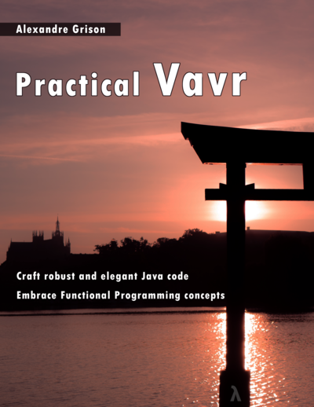

# VAVR kata

This is a hands on session on vavr.
You will learn different concepts incrementally.
Pre-requesite is to understand functional programming paradigm. 

DO the exercises in this order :

* `CollectionsExercises`
* `OptionExercises`
* `TryExercises`
* [`RealLifeExample`](reallife-step-by-step.md)

### To go further ?
[Practical vavr](https://leanpub.com/practical-vavr)

