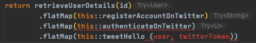

## Step by step RealLife refactoring

* Open
  * `RealLifeExample` in the package `com.bil.katas.vavr.exercises`
  * `AccountService`in the package `com.bil.katas.vavr.account`

### Understand what is implemented

By checking the code we can understand this logic :

1. Given an id
2. Retrieve a user details: email, first name and password (not really secure ;-)
3. Register an account on Twitter
4. Authenticate on Twitter
5. Tweet *Hello I am ...*
6. Update the user details with the Twitter account id

7. Log something in case of success

8. Return the tweet URL

9. In case of error anywhere log something also

This code is easy to follow but has a lot of repetitions (check null values -> return null)

### Define the pipeline

```java
// Given an id 
this.userService.findById(id) // Retrieve a user details
  | this.twitterService.register(user.getEmail(), user.getName()) // Register an account on Twitter
  | this.twitterService.authenticate(user.getEmail(), user.getPassword()) // Authenticate on Twitter
  | this.twitterService.tweet(twitterToken, "Hello I am " + user.getName()) // Tweet *Hello I am ...*
  | this.userService.updateTwitterAccountId(id, accountId) // Update the user details with the Twitter account id
  | this.businessLogger.logSuccessRegister(id) // Log something in case of success
  | this.businessLogger.logFailureRegister(id, ex) // In case of error anywhere log something also
  | tweetUrl // Return the tweet URL
```

## How to ?

* We want to avoid a lot of null checks so we could use `Option` or `Try`

* Here we will use `Try` monad because our business logic is already inside a `try/catch` block
  * We will chain calls through it

This is a step by step guide with a "*naive*" approach :
* Don't anticipate and introduce concepts before we need it
* At everytime the test will compile and tests are green

### 1) Extract "Retrieve a user details" method

Extract `this.userService.findById(id);` into a function returning a Try monad 

```java
@AllArgsConstructor
public class AccountService {

    private final UserService userService;
    private final TwitterService twitterService;
    private final BusinessLogger businessLogger;

    public String register(UUID id) {
        try {
            User user = retrieveUserDetails(id).getOrNull();

            if (user == null)
                return null;

            String accountId = this.twitterService.register(user.getEmail(), user.getName());

            if (accountId == null)
                return null;

            String twitterToken = this.twitterService.authenticate(user.getEmail(), user.getPassword());

            if (twitterToken == null)
                return null;

            String tweetUrl = this.twitterService.tweet(twitterToken, "Hello I am " + user.getName());

            if (tweetUrl == null)
                return null;

            this.userService.updateTwitterAccountId(id, accountId);
            businessLogger.logSuccessRegister(id);

            return tweetUrl;
        } catch (Exception ex) {
            this.businessLogger.logFailureRegister(id, ex);
            return null;
        }
    }

    private Try<User> retrieveUserDetails(UUID id) {
        return Try.of(() -> this.userService.findById(id));
    }
}
```

### 2) Extract "Register an account on Twitter" method

```java
@AllArgsConstructor
public class AccountService {

    private final UserService userService;
    private final TwitterService twitterService;
    private final BusinessLogger businessLogger;

    public String register(UUID id) {
        try {
            User user = retrieveUserDetails(id).getOrNull();

            if (user == null)
                return null;

            String accountId = registerAccountOnTwitter(user).getOrNull();

            if (accountId == null)
                return null;

            String twitterToken = this.twitterService.authenticate(user.getEmail(), user.getPassword());

            if (twitterToken == null)
                return null;

            String tweetUrl = this.twitterService.tweet(twitterToken, "Hello I am " + user.getName());

            if (tweetUrl == null)
                return null;

            this.userService.updateTwitterAccountId(id, accountId);
            businessLogger.logSuccessRegister(id);

            return tweetUrl;
        } catch (Exception ex) {
            this.businessLogger.logFailureRegister(id, ex);
            return null;
        }
    }

    private Try<User> retrieveUserDetails(UUID id) {
        return Try.of(() -> this.userService.findById(id));
    }

    private Try<String> registerAccountOnTwitter(User user) {
        return Try.of(() -> this.twitterService.register(user.getEmail(), user.getName()));
    }
}
```

### 3) Extract "Authenticate on Twitter" method

```java
package com.bil.katas.vavr.account;

import io.vavr.control.Try;
import lombok.AllArgsConstructor;

import java.util.UUID;

@AllArgsConstructor
public class AccountService {

    private final UserService userService;
    private final TwitterService twitterService;
    private final BusinessLogger businessLogger;

    public String register(UUID id) {
        try {
            User user = retrieveUserDetails(id).getOrNull();

            if (user == null)
                return null;

            String accountId = registerAccountOnTwitter(user).getOrNull();

            if (accountId == null)
                return null;

            String twitterToken = authenticateOnTwitter(user).getOrNull();

            if (twitterToken == null)
                return null;

            String tweetUrl = this.twitterService.tweet(twitterToken, "Hello I am " + user.getName());

            if (tweetUrl == null)
                return null;

            this.userService.updateTwitterAccountId(id, accountId);
            businessLogger.logSuccessRegister(id);

            return tweetUrl;
        } catch (Exception ex) {
            this.businessLogger.logFailureRegister(id, ex);
            return null;
        }
    }

    private Try<User> retrieveUserDetails(UUID id) {
        return Try.of(() -> this.userService.findById(id));
    }

    private Try<String> registerAccountOnTwitter(User user) {
        return Try.of(() -> this.twitterService.register(user.getEmail(), user.getName()));
    }

    private Try<String> authenticateOnTwitter(User user) {
        return Try.of(() -> this.twitterService.authenticate(user.getEmail(), user.getPassword()));
    }
}
```

### 4) A few methods later

```java
package com.bil.katas.vavr.account;

import io.vavr.control.Try;
import lombok.AllArgsConstructor;

import java.util.UUID;

@AllArgsConstructor
public class AccountService {

    private final UserService userService;
    private final TwitterService twitterService;
    private final BusinessLogger businessLogger;

    public String register(UUID id) {
        try {
            User user = retrieveUserDetails(id).getOrNull();

            if (user == null)
                return null;

            String accountId = registerAccountOnTwitter(user).getOrNull();

            if (accountId == null)
                return null;

            String twitterToken = authenticateOnTwitter(user).getOrNull();

            if (twitterToken == null)
                return null;

            String tweetUrl = tweetHello(user, twitterToken).getOrNull();

            if (tweetUrl == null)
                return null;

            updateTwitterAccount(id, accountId);
            businessLogger.logSuccessRegister(id);

            return tweetUrl;
        } catch (Exception ex) {
            this.businessLogger.logFailureRegister(id, ex);
            return null;
        }
    }

    private Try<User> retrieveUserDetails(UUID id) {
        return Try.of(() -> this.userService.findById(id));
    }

    private Try<String> registerAccountOnTwitter(User user) {
        return Try.of(() -> this.twitterService.register(user.getEmail(), user.getName()));
    }

    private Try<String> authenticateOnTwitter(User user) {
        return Try.of(() -> this.twitterService.authenticate(user.getEmail(), user.getPassword()));
    }

    private Try<String> tweetHello(User user, String twitterToken) {
        return Try.of(() -> this.twitterService.tweet(twitterToken, "Hello I am " + user.getName()));
    }

    private void updateTwitterAccount(UUID id, String accountId) {
        this.userService.updateTwitterAccountId(id, accountId);
    }
}
```

### 5) Pipeline ?

*Where is the pipeline ? You sell me a pipeline...*

Indeed, so our next step is to put all together : you may have already seen the problem

> Take a look at the method Signature : we are not working on the same kind of data

If we chain our calls we will have something like this :


#### What is the solution ?

* Use a `Context` object that will help to chain calls

```java
private Try<Context> doSomething(Context context)
```

* Create a Context class that will serve as a container of the needed data in the pipeline
* We use lombok features to avoid having to write boilerplate code

```java
@AllArgsConstructor
@With //requires lombok >= 1.18.18
@Getter
public class Context {
    private UUID id;
    private String email, name, password;
    private String accountId, token, tweetUrl;

    public Context(User user) {
        this.id = user.getId();
        this.email = user.getEmail();
        this.name = user.getName();
        this.password = user.getPassword();
    }
}
```

> @With allows us to use withMethod that will return a new Immutable Context based on the current one at each use

* Then chain the calls by changing method signatures :

```java
private Try<Context> retrieveUserDetails(UUID id) {
    return Try.of(() -> this.userService.findById(id))
            .map(Context::new);
}

// example of with usage
private Try<Context> registerAccountOnTwitter(Context context) {
  return Try.of(() -> this.twitterService.register(context.getEmail(), context.getName()))
    .map(context::withAccountId);
}
```

* Repeat it for each method
* At the end you should have a pipeline looking like 

```java
return retrieveUserDetails(id)
.andThen run un side effect mais renvoie this, alors que flatMap renvoie une nouvelle instance de Try
        .flatMap(this::registerAccountOnTwitter)
        .flatMap(this::authenticateOnTwitter)
        .flatMap(this::tweetHello)
        .andThen(this::updateTwitterAccount)
```

> By using @With and withMethods on the Context
> Be aware that you can not use andThen : andThen runs a side effect and returns this
>
> flatMap returnsa new instance of Try

* Add the logging part to it

```java
return retrieveUserDetails(id)
        .flatMap(this::registerAccountOnTwitter)
        .flatMap(this::authenticateOnTwitter)
        .flatMap(this::tweetHello)
        .andThen(this::updateTwitterAccount)
        .onSuccess(context -> businessLogger.logSuccessRegister(id))
        .onFailure(exception -> businessLogger.logFailureRegister(id, exception))
        .map(Context::getTweetUrl)
```

* We still have a problem to solve here
  * The map line returns a Try<String>
  * Our consumers are ready to handle null value so let's materialize it by returning an Option

```java
public Option<String> register(UUID id) {
    return retrieveUserDetails(id)
            .flatMap(this::registerAccountOnTwitter)
            .flatMap(this::authenticateOnTwitter)
            .flatMap(this::tweetHello)
            .andThen(this::updateTwitterAccount)
            .onSuccess(context -> businessLogger.logSuccessRegister(id))
            .onFailure(exception -> businessLogger.logFailureRegister(id, exception))
            .map(Context::getTweetUrl)
            .toOption();
}
```

* We need to adapt the consumers : aka the tests here

```java
@Test
public void register_BudSpencer_should_return_a_new_tweet_url() {
    String tweetUrl = accountService.register(BUD_SPENCER).getOrElse("Registration failed");
    Assert.assertEquals("TweetUrl", tweetUrl);
}

@Test
public void register_an_unknown_user_should_return_an_error_message() {
    String tweetUrl = accountService.register(UNKNOWN_USER).getOrElse("Registration failed");
    Assert.assertEquals("Registration failed", tweetUrl);
}
```

* We end up with something like :

```java
package com.bil.katas.vavr.account;

import io.vavr.control.Option;
import io.vavr.control.Try;
import lombok.AllArgsConstructor;

import java.util.UUID;

@AllArgsConstructor
public class AccountService {

    private final UserService userService;
    private final TwitterService twitterService;
    private final BusinessLogger businessLogger;

    public Option<String> register(UUID id) {
        return retrieveUserDetails(id)
                .flatMap(this::registerAccountOnTwitter)
                .flatMap(this::authenticateOnTwitter)
                .flatMap(this::tweetHello)
                .andThen(this::updateTwitterAccount)
                .onSuccess(context -> businessLogger.logSuccessRegister(id))
                .onFailure(exception -> businessLogger.logFailureRegister(id, exception))
                .map(Context::getTweetUrl)
                .toOption();
    }

    private Try<Context> retrieveUserDetails(UUID id) {
        return Try.of(() -> this.userService.findById(id))
                .map(Context::new);
    }

    private Try<Context> registerAccountOnTwitter(Context context) {
        return Try.of(() -> this.twitterService.register(context.getEmail(), context.getName()))
                .map(context::withAccountId);
    }

    private Try<Context> authenticateOnTwitter(Context context) {
        return Try.of(() -> this.twitterService.authenticate(context.getEmail(), context.getPassword()))
                .map(context::withToken);
    }

    private Try<Context> tweetHello(Context context) {
        return Try.of(() -> this.twitterService.tweet(context.getToken(), "Hello I am " + context.getName()))
                .map(context::withTweetUrl);
    }

    private void updateTwitterAccount(Context context) {
        this.userService.updateTwitterAccountId(context.getId(), context.getAccountId());
    }
}
```

What do you think about it ?
